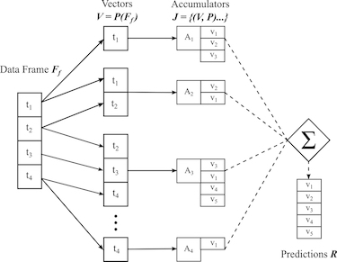

# [VegML](http://www.sedro.xyz/vegml)
## Vector Addressed Accumulated Memory
A vector addressed memory where each instance of a saved/trained value is counted 
allowing for totals, frequency and probability to be assessed on each value, or set of values.

## Java reference Implementation of Relational Probability Memory (RPM)
Included is the references implementation of RPM and many examples and tools for tuning and evaluating.
RMPs are a form of Non-Neural Machine Learning that are capable of producing inference results on par or better than Neural networks, but with less complexity and more visibility.

---

---

## Documentation
Documents introducing Relational Probability Memory and VegML are located under /docs

---
# Getting started
The tutorials should get you started quickly with the sample code for your language of choice.
There is no need to have known any data science or machine learning to get up to speed on VegML.

Examples presented cover Part-of-Speech tagging, review sentiment, and linear motion.

The simple flow to get started:

Create an instance

		VegML vML = new VegML(window, "move1-"+window);'
		vML.setDescription("test instance");			
Add a dataplane with window size 5 and set it as the default
	
		vML.addDataPlane("text", "value", 5, -1);
		vML.setInfoDefaultDataPlane("text", "value");		
By default the dataplane will have a powerset of number sets. APIs on vML allow additional configuration 
for this model if desired.

Load a dataset
		
		VDataSets dss = new VDataSets();
		//TODO load data
		ds.genVSets();
Train the model

		ResultSet ts = VegTrain.trainDataSets(vML, "text", "value", dss);
Tuning is usually be done at this point to get the desired size and accuracy

Test the Model and get results

		ResultSet tsk = VegTest.testSets(vML, "text", "value", testDss);		
To use the Model for functional predictions the predict APIs in VegTest should be used. 
Examples can be found in the example code.

---
### Java
Java examples are located in src/main/java/org/sedro/examples/ 

More information [Example Notes](./src/main/java/org/sedro/examples/README.md)

### JavaScript
There is a base minimal implementation of VegML. It currently supports only prediction from existing models
[NOTE the example models need update to the new smaller more accurate]

JavaScript examples are located in web/js

## Python

	looking for contributors to work in python
	

## build and deploy
Build and deploy VegML Java with maven

	cmdline# mvn clean;mvn install;mvn deploy

# License
Sedro software is open source under GPLv2 and can be licensed for commercial applications

Full license: [COPYING](./COPYING.md) (COPYING.md)

At GNU: [https://www.gnu.org/licenses/old-licenses/gpl-2.0.txt](https://www.gnu.org/licenses/old-licenses/gpl-2.0.txt)

# Become a Contributor
Start be reading our [code of conduct](./CODE_OF_CONDUCT.md) (CODE_OF_CONDUCT.md) 
and our [contributing](./CONTRIBUTING.md) (CONTRIBUTING.md) guidelines.

If you've created a cool example, extension or port to a new language contribute back and help VegML grow

